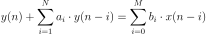

This post is written as a summary of my university lectures in deep learning, with the purpose of helping me revise and understand the concept of RNNs. If you are looking for a detailed introduction to RNNs then this post might offer just that.

Before getting into recurrent neural networks, let us first take a recap of recursive and non recursive filters.

## Infinite Impulse Response (IIR) Filters vs. Finite Impulse Response (FIR) Filters

A general recursive filter or IIR filter with the input x(n) and output y(n) is described by the recursive difference equation:

